## 一个跨域问题的解决方案
```JavaScript
var url="https://api.github.com/users/guofei9987/repos?page=1";

a=[]
var xmlhttp = new XMLHttpRequest();
xmlhttp.onreadystatechange = function() {
  if (this.readyState == 4 && this.status == 200) {
    var myObj = JSON.parse(this.responseText);
    //document.getElementById("demo").innerHTML = myObj.name;
    console.log(myObj);
	a.push(myObj);
  }
};
xmlhttp.open("GET", url, true);// false 会阻塞直到 readyState=4，true（默认）会立即返回并在后台线程中基础处理
xmlhttp.send();
```

### XMLHttpRequest
#### readyState
- 0	Uninitialized	初始化状态。XMLHttpRequest 对象已创建或已被 abort() 方法重置。
- 1	Open	open() 方法已调用，但是 send() 方法未调用。请求还没有被发送。
- 2	Sent	Send() 方法已调用，HTTP 请求已发送到 Web 服务器。未接收到响应。
- 3	Receiving	所有响应头部都已经接收到。响应体开始接收但未完成。
- 4	Loaded	HTTP 响应已经完全接收。


readyState 的值不会递减，除非当一个请求在处理过程中的时候调用了 abort() 或 open() 方法。每次这个属性的值增加的时候，都会触发 onreadystatechange 事件句柄。

#### responseText
目前为止为服务器接收到的响应体（不包括头部），或者如果还没有接收到数据的话，就是空字符串。

如果 readyState 小于 3，这个属性就是一个空字符串。当 readyState 为 3，这个属性返回目前已经接收的响应部分。如果 readyState 为 4，这个属性保存了完整的响应体。

如果响应包含了为响应体指定字符编码的头部，就使用该编码。否则，假定使用 Unicode UTF-8。


---------------------

## mermaid语法
教材：http://knsv.github.io/mermaid
### Possible directions are:

- TB - top bottom
- BT - bottom top
- RL - right left
- LR - left right

- TD - same as TB

### Nodes & shapes

- A node (default)
```
graph LR
    id1
```
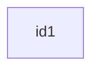

- A node with text
```
graph LR
    id1[This is the text in the box]
```
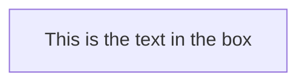

- A node with round edges
```
graph LR
    id1(This is the text in the box);
```
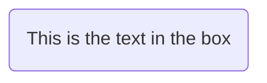
- A node in the form of a circle
```
    graph LR
        id1((This is the text in the circle));
```
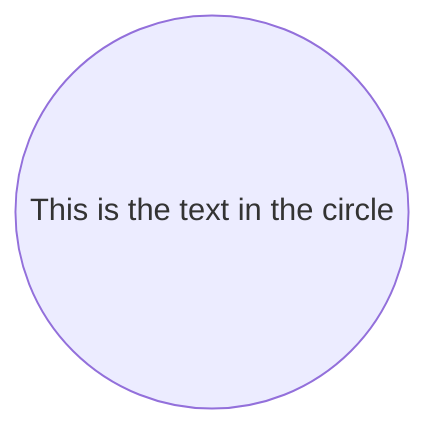
- A node in an asymetric shape
```
graph LR
    id1>This is the text in the box]
```
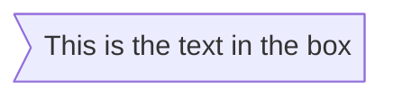
- A node (rhombus)
```
graph LR
    id1{This is the text in the box}
```
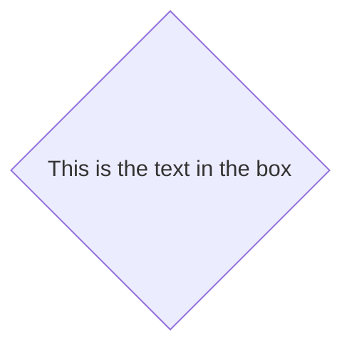

#### Links between nodes

- A link with arrow head
```
graph LR
    A-->B
```


- An open link
```
graph LR
    A --- B
```
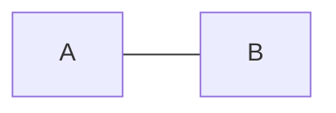
- Text on links
```
graph LR
A-- This is the text --- B
```
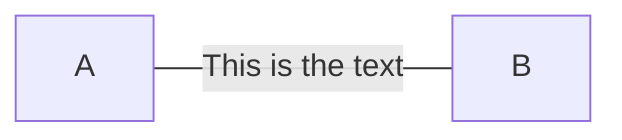

or
```
graph LR
A---|This is the text|B;
```


- A link with arrow head and text
```
graph LR
A-->|text|B
```
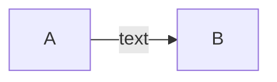

or
```
graph LR
A-- text -->B
```


- Dotted link
```
graph LR
A-.->B
```
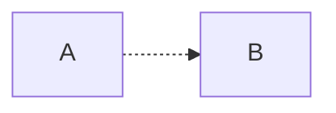

- Dotted link with text
```
graph LR
A-. text .->B
```
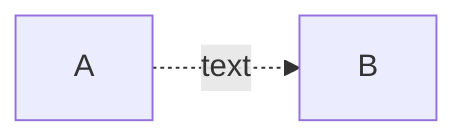

- Thick link
```
graph LR
A==>B
```
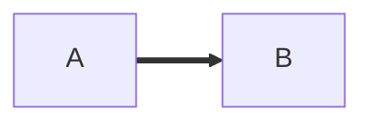

- Thick link with text
```
graph LR
A== text ==>B
```
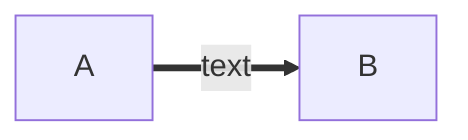

### Subgraphs
```
%% Subgraph example
graph TB
        subgraph one
        a1-->a2
        end
        subgraph two
        b1-->b2
        end
        subgraph three
        c1-->c2
        end
        c1-->a2
```
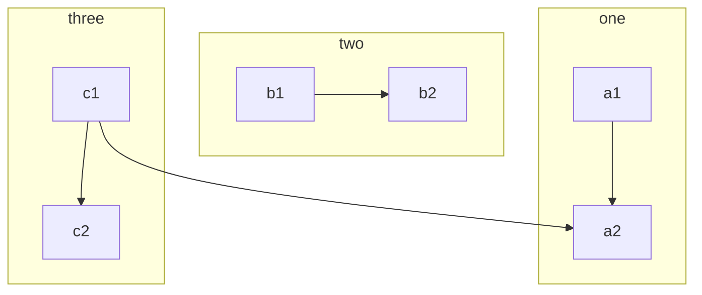

### Styling a node
```
%% Example code
graph LR
    id1(Start)-->id2(Stop)
    style id1 fill:#f9f,stroke:#333,stroke-width:4px;
    style id2 fill:#ccf,stroke:#f66,stroke-width:2px,stroke-dasharray: 5, 5;
```
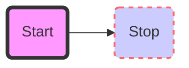

## 案例：
```
%% Code for flowchart below
graph TB
    sq[Square shape] --> ci((Circle shape))

    subgraph A subgraph
        od>Odd shape]-- Two line<br>edge comment --> ro
        di{Diamond with <br/> line break} -.-> ro(Rounded<br>square<br>shape)
        di==>ro2(Rounded square shape)
    end

    %% Notice that no text in shape are added here instead that is appended further down
    e --> od3>Really long text with linebreak<br>in an Odd shape]

    %% Comments after double percent signs
    e((Inner / circle<br>and some odd <br>special characters)) --> f(,.?!+-*ز)

    cyr[Cyrillic]-->cyr2((Circle shape Начало));

     classDef green fill:#9f6,stroke:#333,stroke-width:2px;
     classDef orange fill:#f96,stroke:#333,stroke-width:4px;
     class sq,e green
     class di orange
```
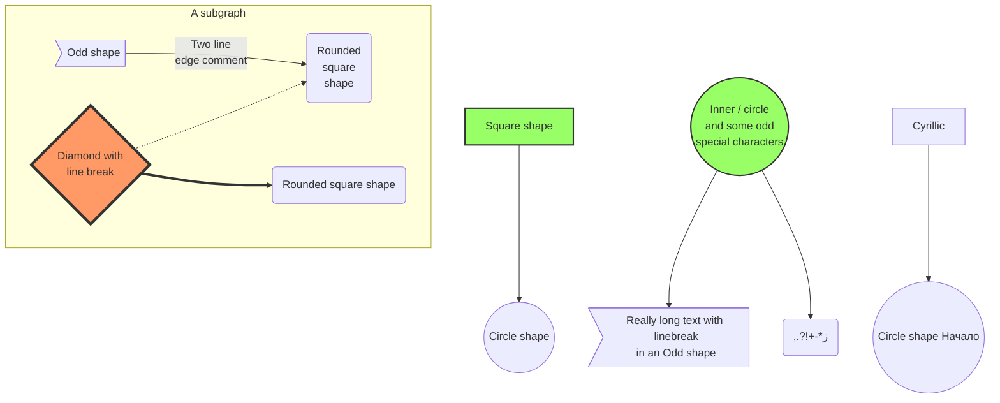


```
graph BT
A[Christmas] --> B(go shopping)
B --> C{let me think}
C-->|one| D[laptop]
C--> |two| E[iphone]
C--> |three| F{a}
```
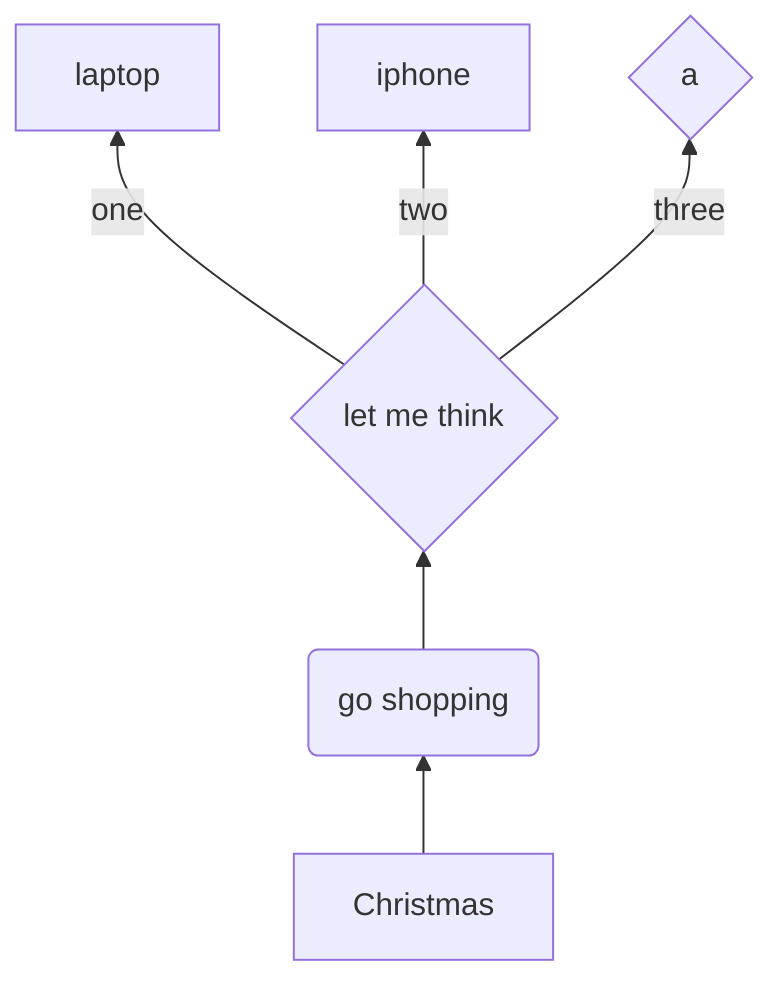
