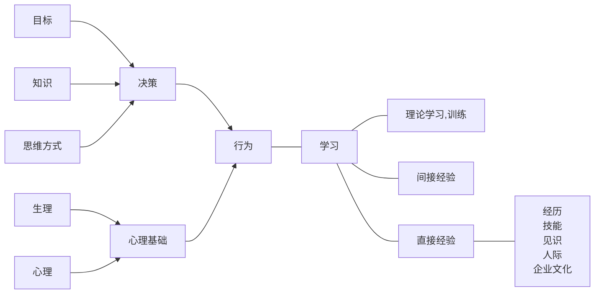

# 编辑中
## 《管理学》

### 管理学工具
Swot  
PDCA:plan,do,check,action  
6w2h:what  why  who  when  which  how    how much  
SMART:specific  attainable  measurable relevant  time-based  

### 史前积累
### 古典管理理论
#### 泰罗
- 科学管理的中心问题是提高劳动生产率
- 需要挑选一流的工人。（所谓一流的工人，是适合某种工作，并且愿意努力的人
- 标准化
- 刺激性报酬
- “精神革命”：双方合作，共同“把蛋糕做大”
- 计划职能和执行职能分开。科学方法代替经验方法
- 职能工长制，细化生产过程
- 例外原则。日常事务授权部下负责，管理人员只对例外（重大）事项保留处置权

#### 法约尔
六种经营活动：
1. 技术活动（生产）
2. 商业活动（交换）
3. 财务活动
4. 安全活动
5. 会计活动
6. 管理活动

五大管理职能：
- 计划
- 组织
- 指挥
- 协调
- 控制

14个原则：
- 劳动分工原则
- 权力与责任对等原则
- 纪律原则
- 统一指挥原则
- 统一领导原则
- 个人利益服从整体利益原则
- 员工报酬原则
- 集权原则
- 等级系列原则
- 秩序原则
- 公平原则
- 人员稳定
- 首创精神

#### 马克斯
- 规定每个岗位的权力与责任
- 按照不同职位的权力大小，形成有序的等级系统，以制度巩固下来
- 明确规定职位特性
- 权力从属于地位，服从于制度，而不是某个人
- 每人都拥有执行自己职能所必要的权力。权力严格限制
- 管理者的职务是他的职业，忠于职守，而不是忠于某个人

行为和学习是个体的两个基本特征

#### 现代观点
1. 管理是组织的特殊器官
2. 管理的实质是协调
3. 是有意识的协调
4. 是维持机体协作延续发展的行为

正式组织的三要素：
1. 协作意愿
2. 共同目标*是吗？现代社会表示怀疑*
3. 信息沟通

### 企业环境
能动性：
1. 一定范围内选择行业、地区
2. 创造与影响环境

什么是环境：
1. 顾客
2. 资金供应者
3. 劳动者
4. 原材料、设备、商品供应者
5. 政府
6. 竞争对手

- 企业不仅仅是一个经济组织，也是一个由人组成的集团。无论企业家还是员工，除了利润最大化，还有事业、感情、自我追求、理想等。经济利益并非全部。
- 企业的目的：发展、生存
企业面对的问题：企业战略、企业制度

- 企业的目标：利润，所有者、管理者、职工的要求
    - 企业目标反映一个组织的价值
    - 为各方面活动提供方向
    - 是企业与环境的动态平衡
- 企业战略
    - 根据发展需要而制定的
    - 要点不在于内部管理，而在于环境对企业的要求
        - 经营范围
        - 资源配置
        - 竞争优势
        - 协同优势
    - 长期
    - 与行动和现实结合

### 市场和计划
社会主要是市场起作用，企业内部主要是计划起作用
- 市场的优点
    - 企业自主性
    - 分配资源
    - 积极性、主动性
- 市场的缺点
    - 不确定性、盲目性
    - 不公平竞争
    - 资源浪费（交易费用、信息费用）
    - 机会主义、不择手段

### 经营资源
- 资金
- 物质资源
- 人力资源
    - 非熟练工通用性高
    - 熟练工通用性低
- 信息
    - 商业秘密
    - 技术、顾客、市场情报
    - 企业形象
    - 企业文化
    - 职工到的

企业的核心能力
:    有用性、不可替代性、不可模仿性

企业的产出
:    资金、信息、人。其中，人是企业最重要的额资源

### 多元化战略
- 有效利用资源，包括 信息、技术、专利、商标
- 优化成本结构（因为新员工的工资低）
- 激发员工的士气
    - 发展时期员工热情高涨
    - 更多的晋升机会
- 范围经济
- 分散风险

### 资源配置的战略
- 预算式（更接近计划）
- 分散式（更接近市场）
    - 缺点：
        - 资金不足与闲置，造成浪费
        - 受短期影响较大的项目，长远难以获得足够的投资
    - 方法
        - 减少总公司对下级的直接控制
        - 允许经营单位有自有资金，累积盈利，以作为今后的投资资本
        - 总公司有类似银行的功能，对子公司提供贷款
        - 以企业整体战略为方针

### 国际化
原因：
- 市场与资源在不同的国家
- 政治：规避贸易壁垒
- 经济：规避金融风险
- 提高效率：生产地和经营地的物流等成本

是否国际化的分析：
- 政治环境
    - 政府体制、政党制度、国家利益
    - 政治稳定性
    - 对待外资的态度
- 法律环境
    - 国际法
    - 对方国家的国内法
- 社会文化
    - 事实性知识、语言、宗教、物质文化、审美、教育
    - 人生态度、对权威态度、价值观
- 经济环境
    - 经济水平
    - 市场完善与开放程度
    - 基建、金融、文教、通讯、能源
    - 稳定
    - 经济政策
    - 技术环境

### 外部关系
- 社会责任
- 股东
    - 小股东
    - 投资机构
    - 金融舆论专家
- 消费者
- 交易伙伴
    - 供应商
    - 经销商
- 政府关系
    - 宏微观调控、利益分配、信息导向、资金来源与客户
- 媒体

### 组织管理

领导的职能：
- 奋斗目标、方向
    - 明确or方向性
    - 唯一or多元
    - 挑战or现实
- 企业文化
    - 气场是稳定or创新
- 外部关系
    - 沟通时，坚持or折中
- 分解任务、激励
   - 用人时，生产优先or人际优先？

### 其它

发展
:    不断破坏原油均衡的过程
