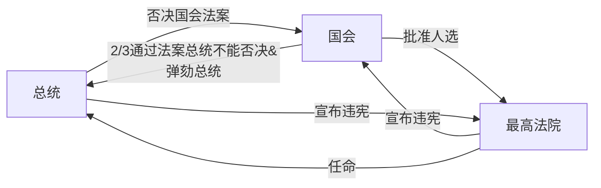

## 《欧洲文明十五讲》
[亚马逊购书链接](https://www.amazon.cn/dp/B007VATB8E/)

欧洲文明的源头是“两希文明”，就是希伯来和希腊。然后呢，就是罗马，再加上基督教文明，这就是欧洲文明的源头。

雅典的制度变革
- 公元前600年。德拉孔立法。使公共事务不能几个人说了算，否则极刑。
- 梭伦改革。
- 伯利克里改革。

英法百年战争。圣女贞德，法国胜利。  
英国内战。  

古罗马留下的精神财富（虽然哲学很弱）
- 法律精神，
- 行政管理经验；

文艺复兴人物
- 但丁。不自觉的人文主义者。
- 彼特拉克。第一个人文主义者
- 薄伽丘。《十日谈》揭露神职人员的丑恶。
- 马基雅维利。《君主论》，政治是脱离道德的，不择手段。

从14世纪到16世纪的重要事情，主要有这么几件：
- 科学思维的产生。从哥白尼“天文革命”开始，人们不再根据神的意旨或者说教会的意旨来看世界，看宇宙，看人，而是有了自己客观的观察。
- 地理大发现，
- 文艺复兴，
- 宗教改革。这几件事情综合在一起，反映了这个时代的特点：人的精神在解放，眼界在拓宽；人对世界的认识，对社会的认识，对人自身的认识，都在发生与中世纪不同的根本性变化。

## 历史上的经济政策
### 商鞅的经济政策
井田制：划分九个格子，周围8块田地产出归8户农奴，中间部分产出归贵族。  

废除井田制，承认土地私有，允许土地买卖。结果：  
1. 调动农民积极性。多劳多得。
2. 可以拥有土地。相当于鼓励开荒
3. 土地转移到高效率所有者身上。

坏处：贫富分化

好处
1. 以前的阶层是贵族、国人、农奴，现在农奴也变成国人了，兵源大大增加
2. 土地可以买卖，贵族阶级实际上消失了

### 汉朝的经济政策
#### 文景之治
- 刚刚战争，贫富分化不剧烈
- 刚刚战争，人口较少，资源较多
- 文景黄老之术，不耗民力

#### 汉武帝

- 推恩令，削弱豪强
  1. 让诸侯越来越小
  2. 激化长子与次子们的矛盾
- 罢黜百家，独尊儒术
- 扩大对外战争。尤其是一劳永逸解决匈奴问题。
- 收回盐铁经营权

黄老之术→汉武帝经济学
司马迁对商人的态度：善者因之，其次利导之，其次整齐之，最下与之争
儒、墨、道、法：墨太苦、法太臭、道太难。唯独儒家与下层宗教观念、孝悌相符，而且前提是有利于帝国组织的巩固。

#### 王莽改革
1. 国营盐铁酒
2. 国家放款
3. 国家库存平价贸易
4. 荒弃土地收税
5. 无业游民收税
6. 所得税

（另一本书上写的王莽改革）
1. 试图搞计划经济（当然，底层老百姓不支持，也就无法禁止买卖）
2. 按照《周礼》多次更改货币、地名、外国名字。

### 中国的人才政策
**“察举制”** 的做法是，先由地方官寻找品学兼优的人才，把他们推荐给朝廷，朝廷再安排考试。通过考试的人就可以当官了。  
“九品中正制”的做法是，设立一些叫作“中正”的官员，由这些官员去把知名人士分成九个等级，按照这个等级来安排官员升降。  
简而言之，这两种制度都是靠官员推荐人才。和世袭制相比，这种制度意识到官员应当从民间广泛选拔。但它们的缺点是选拔的过程漏洞太大。靠“个人推荐”来选拔官员，很容易造成亲友之间互相推荐，最终就形成了由大家族垄断权力的门阀社会。比如到了两晋的时候，有一句话叫“上品无寒门，下品无世族”。“寒门”是没有背景的普通人家，“世族”是大家族。这句话的意思是说，所谓“九品中正制”看着好像是在品评人们的品德学问，其实品评的是家族背景，有背景的就是上品，没背景的就是下品，非常不公平。  
“察举制”和“九品中正制”的本意是改掉权力世袭的坏习惯，但是因为“人类把好东西都给子孙”的本能实在是太强大了，制度上只要有一点儿漏洞，马上就会被大肆利用。所以这两个制度最终还是退化成了权力世袭制，制造了门阀社会。

**科举制度** 是打击权力世袭制的又一次努力，而且非常成功。  
科举制有两个关键的地方：第一，任何人都可以参加考试。第二，只以考试结果论成绩，权贵推荐不是说没用，但已经不起主要作用了。  
科举制的好处非常明显：它杜绝了权贵互相推荐，人们是靠考试成绩而不是血缘进入官场。魏晋南北朝的那种多少代人都当大官的门阀大家族也就渐渐消失了，门阀社会的种种弊病也就没有了。  
科举制度的另一大好处是增加了社会的流动性。贵族和门阀社会的社会流动性就很差，“上品无寒门，下品无世族”么，穷人永远也出不了头。这造成了社会的不公正，造成了底层百姓对上层的仇视，造成了真正的人才不能为国家所用，反倒成了国家的敌人。在科举制下，没有背景的普通百姓也可以通过念书考试进入社会上层。反过来，原本的豪门子弟如果不好好念书，也会很快没落，沦为平民。这样做的结果是增加了社会的稳定性，每个百姓都有出头之日，每个权贵都不能得意忘形，国家最大程度地吸收人才。  
因为科举制的实行，中国百姓有了一个非常好的传统：重视知识、重视读书、尊重知识分子。祖训、家规都强调子弟要好好念书。过去很多宗族会僻出一些公田，用来供养宗族内没有钱的孩子去念书。直到今天，在我国的贫困地区，一个家族竭尽全力供一个孩子读书的情况仍旧屡见不鲜。
那些家族这么做，出发点是很功利的：只要子弟考个好成绩，当上了大官，家族就能兴旺，每个成员都能获利。但是在客观上，这观念让中国变成了一个遍地礼仪诗书的国度，把知识的光明带到每一处乡间。  
明末清初的时候，欧洲的知识界第一次比较详细地了解中国，像伏尔泰那样的大知识分子一看到中国的文化制度，当时就崇拜得五体投地——一个处处尊重知识的国度，这就是柏拉图设想的“由哲学家统治国家”的理想国啊，比靠宗教和贵族统治的欧洲要高了不止一个等级。中国全社会的文明程度，是当时的欧洲难以企及的。

为什么中国人不早点实行科举制呢？技术原因导致的读书成本问题。  

## 政体科普
- 三权分立：立法权、司法权、行政权  
- 亚里士多德，政体三要素：议事权、行政权、审判权  
- 洛克《政府论》：立法权----议会。行政权、对外权----国王  

### 美国总统制：
总统、国会、最高法院  

### 英国内阁制
#### 上议院
- 贵族院
    - 王室后裔、世袭贵族、新封贵族、上诉法院法官、教会
- 司法机关
    - 议长由大法官兼任，又是法律大臣

#### 下议院
- 平民院、众议院
    - 选举产生
- 立法权、财政权、行政监督权  

提出议案→议会辩论→经三读通过→上议院→英王  

### 孙中山五权宪法
立法权、行政权、司法权、监察权、考试权  

平等和自由是天敌。少数人的自由和多数人的平等是矛盾的。  

## 小故事
### 宣武门之变的后续影响。  

李世民杀掉长子，自己做皇帝，带来篡位的风气。  
李世民的太子、四子模仿下，也使用暗杀手段。所以把皇位传给了最老实的李治。  
李治的软弱结果是武则天当政的关键。  

武则天当皇帝需要做的事
1. 争取人才：建立科举制，以提拔同样没有后台的人才。借此对抗李渊体系的关陇集团的人才体系。
2. 找到一个能放到明面上的思想。儒教不行，因为武则天是女人，又要篡位。道教不行，李氏已经占了这个IP。最终的选择是佛教。
3. 强化内里的法家思想。使用酷吏。
4. 采用告密制度。告密制度的结果是全社会都经不起考验，整个社会最基本的人际关系都被破坏掉，变成一个《大逃杀》游戏。

### 李隆基把府兵制改为募兵制
府兵制是指定一批人为军户，不用纳税。不用政府养，但战斗力差。  
府兵制终结的原因：
1. 用兵太多
2. 土地集中，导致兵户分配不到太多土地。

结果：很多府兵变成土匪。  

解决：改为募兵制度。提高了战斗力，但容易造成军阀割据。安史之乱。  

安史之乱后为何唐朝衰落
- 节度使（军阀）战乱
- 吐蕃连续入侵
- 宦官专政（宦官原本是为了制约节度使）

### 宋朝
赵匡胤陈桥兵变，黄袍加身。  

总结前朝教训
- 唐朝地方军权太大
- 唐朝宦官专政（有替皇帝批改文件和传递文件的权力，有禁军的兵权）
- 五代十国军人政变。

三个教训总结为一条：军权过于集中，解决方案：
- 保证禁军的数量、质量
- 将领轮岗。“兵不知将，将不知兵”
- 缩小宰相的权力，划分为三个部门
- 重文轻武
- 不允许宦官学习文化
- 限制皇帝的权力

### 明末
- 党派斗争，使得政治正确压倒一切。求和、防守都被认为是政治不正确。
- 小冰期
- 实物税赋质量不一，经办人有很大的腐败空间。张居正“一条鞭法”，把实物税和徭役合并为银两。问题是，东北战乱，向东北拨军费是银两，东北屯田减少，商人也不愿意运粮过去。导致东北银多粮少，内地税收负担也很重。
- 全球白银危机。明朝时，美洲发现银矿，明末银矿产量开始下降，欧洲恰好出现经济危机，对华贸易骤减。日本闭关锁国，这个白银来源也断了。

### 清军入关
一个很聪明的招：为崇祯帝复仇

#### 辫子问题
凡是在特别强调团结的集体里，都会有羞辱新人的现象。  
羞辱新人的意义就在于，每一个人在加入集体之前，他都是拥有独立人格的自由人。这种状态下的人是不能真正服从集体的。羞辱新人，是为了先摧毁他的自尊，让他认识到自己的尊严、人格一文不值。等到这个人的自我认同全都崩溃了，再让他经历和队友同吃同住、同享受同患难的集体生活。让他重新建立完全依赖于集体的人格，变成一个集体观念极强，能完全服从集体的人。

实行剃发令，第一是把那些拒绝迎合政府的顽固知识分子挑出来，把他们肉体消灭。第二是要让那些嘴上说投降心里面却瞧不起满清的知识分子遭受一次肉体和精神上的双重羞辱  
这剃发，就相当于是知识分子降清的投名状。
#### 皇权问题
宋、明、清的皇权依次增强。  
但是大权独揽是有风险的，如果皇帝昏庸，或者懒得管理操作，会出现大臣专权、宦官专权、外戚专权。  

清朝解决方式：
1. 实行严酷的皇家教育制度。
2. 择优继承。  
    为了防止继承问题的强烈冲突，有设计了“秘密立储制度”  
  - 太子本人不知道被选中了，所以不会骄傲自大，不会谋杀现任皇帝。群臣也没有动力过早攀附
  - 老皇帝可以随时撤换接班人，不会引起大的震荡
  - 所有可能的继承人都老老实实的
  - 缺点是，胜出者大多拘谨、保守。恰逢世界多变。
