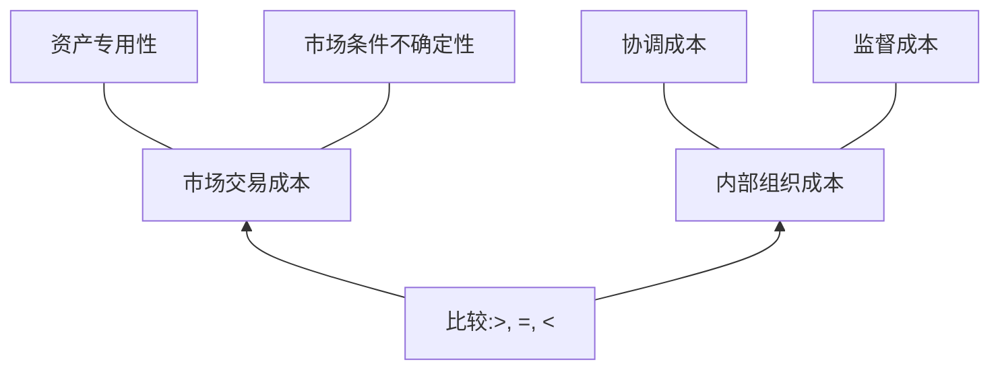
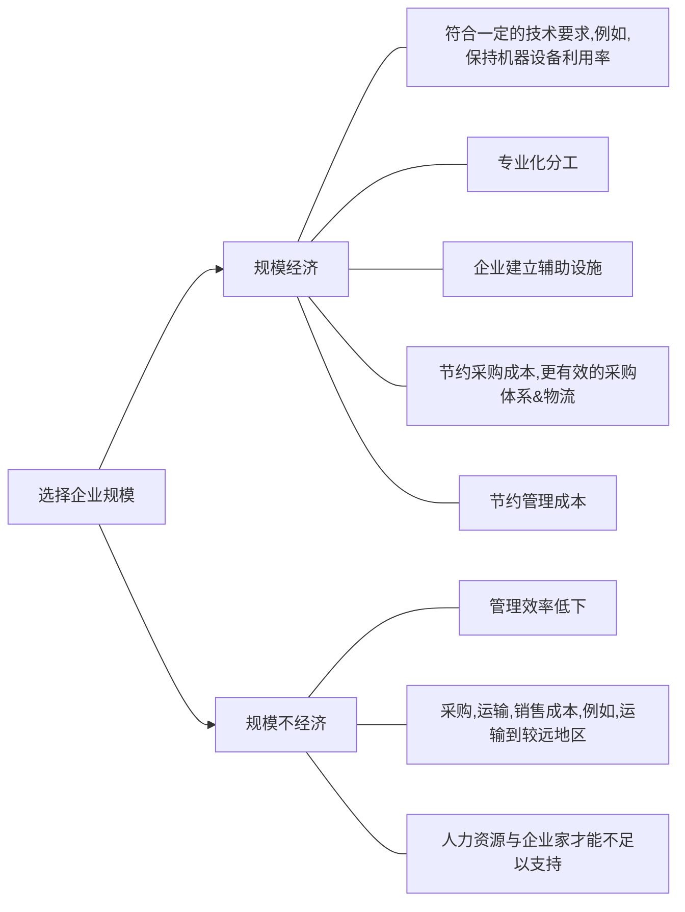
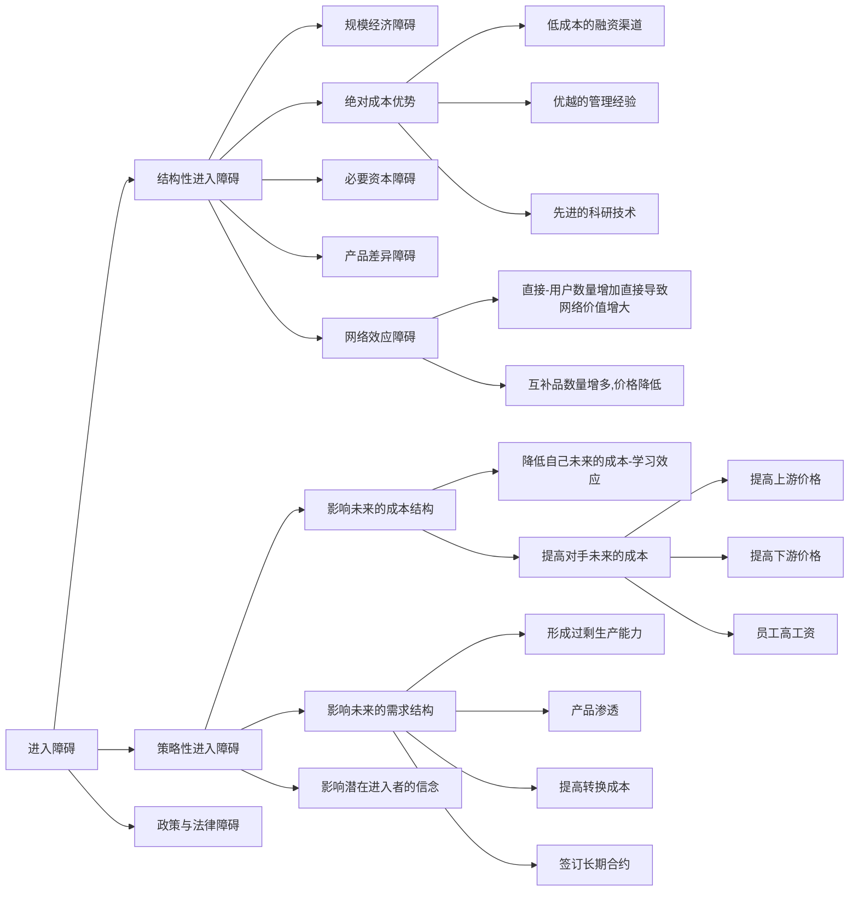
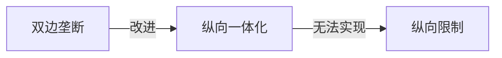
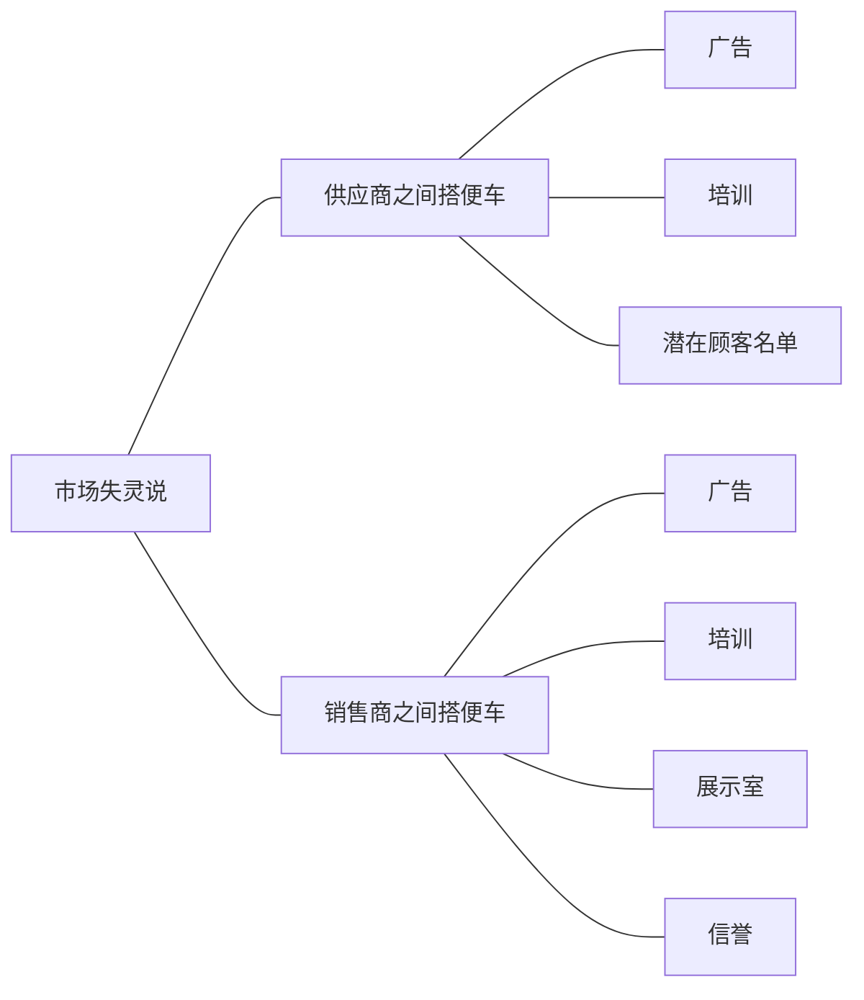

## 《产业经济学》
### 产业的划分
一、按时间划分：1、初始生产阶段2、开始于工业革命3、开始于20世纪初（三大产业）  
二、需求的交叉弹性划分  
三、供给的角度：一定区域内，生产同类或同一产品服务的企业集合  

### 流派
#### 一、哈佛学派
scp范式：市场结构→企业行为→市场绩效
“集中度---利润率”：利润率高原因是垄断性强，垄断性强导致低效率
公共政策：对其进行规制

#### 二、芝加哥学派
（批判哈佛学派）
1、高集中度、高利润是大企业高效运营的结果
2、非高效、高利润会被大量涌入
3、高效率企业不断扩大成为高集中
公共政策：反对一切形式的政府干预

#### 三、新产业组织论
1、不完全信息：人的预测能力有限，外界环境复杂不确定
2、交易成本：产权的界定、实施和监督
3、有限理性：企业不具有获取所有瞬时变化的所有市场信息
公共政策：进退无障碍理论。只要保持市场进出自由，不存在进出成本，就是有效率的，不管是完全垄断还是寡头垄断。

### 企业
#### 企业的性质

#### 企业的规模

### 市场的结构
卖方之间，推销产品的竞争
买方之间，资源占有的竞争
卖方与买方之间，经济、技术、交易关系，价格上的竞争

完全竞争：1、集中度低（大量的买方与卖方）2、产品无差异（完全替代，需求价格弹性无穷大）3、进退无障碍4、完备信息
完全垄断：1、集中度100%2、产品不可替代3、进退障碍非常高（规模经济障碍、资金障碍、技术障碍、法律障碍）4、企业决定价格
垄断竞争
寡头垄断

#### 集中度
影响因素：1、规模经济2、市场容量3、垄断动机和垄断行为4、市场变化

集中度的计量：绝对集中度：1、集中度指标：
$CR_n=\dfrac{\sum \limits ^n x_i}{\sum \limits ^N x_i}$

集中度曲线：
- 绝对指标：集中度指标，集中度曲线
- 相对指标：洛伦兹曲线，基尼系数
- 其它指标：赫芬达尔指标（HHI），熵指数（EI）S*logS

#### 差异化
差异化的影响因素：
- 产品的物理差异
- 产品销售地理位置差异（购买时间、成本、便利）
- 客户服务方面的差异
- 特殊销售活动（广告、宣传、包装、商标、改变偏好）
- 买方的主观差异

差异化的表现：
- 产品主体差异
- 品牌差异
- 功能差异
- 定价差异
- 服务差异

差异化的指标：
- 需求交叉价格弹性
- 供给交叉价格弹性

#### 进退障碍
- 进入障碍
    - 规模经济
    - 资金
    - 产品差异化④政策
- 退出障碍
    - 沉没成本（专用资产）
    - 员工解雇成本（培训。。。）
    - 联合生产
    - 法律政策

### 垄断
#### 完全垄断
原因：
1. 规模经济（自然垄断等）
2. 原材料独家占有①先行优势②自然地理优势
3. 专利权

分类：
1. 行政垄断
    - 种类：
        - 政府垄断
        - 政府授权
    - 作用方式：
        - 排除
        - 支配
        - 妨碍
    - 表现形式
        - 地区垄断
        - 部门垄断
        - 行政性强制行为
2. 自然垄断
  - 原因：成本劣加性。规模经济是自然垄断的充分不必要条件
  - 特征：
    - 追求效率最高：规模经济、范围经济、上下游
    - 网络经济：网络节点边际收益大，复杂工序衔接性
    - 资产专用性与沉淀性
    - 普遍服务性
  - 规制：
    - 公有制：优点是效率优先而不是利润。缺点是缺少降低成本与提高质量的动力，主要服务政治利益，而不是社会利益
    - 激励
    - 特许投标
    - 放松规制

#### 买方垄断
零售商自身的实力，采购量，谈判力量
纵向一体化与横向兼并
消费者需求特征
限制：福利效应、水床效应

#### 寡头垄断
##### 古诺
假设：
- 同质
- 只有两家
- 产量竞争
- 边际成本固定，没有固定成本
- 市场需求线性，都了解市场需求曲线
- 企业有能力无限生产
古诺：一次竞争。

##### 动态古诺模型（就是斯坦克尔伯模型）：
假设：
- A先选择产量，B观察到A的选择后，再选择自己的产量
- 同质
- 边际成本固定，没有固定成本
- 市场需求线性，都了解市场需求曲线
- 企业有能力无限生产

A先选择。先算B的反映函数，代入A

##### 伯川德模型：
假设：
- 只有A,B,没有其他厂商。产量竞争，一次竞争
- 同质
- 边际成本固定，没有固定成本
- 没有任何串谋
- 企业有能力无限生产

同上，价格竞争，没有串谋。
**伯川德悖论**：只有两家企业也足以恢复竞争。
（悖论的解决生产能力约束，动态竞争，产品差异化）

##### 异质产品伯川德
$\left \{ \begin{array}{ccc}
q_A=a-P_A+P_B\\
q_B=a-P_B+P_A
\end{array} \right .
\Rightarrow
\left \{ \begin{array}{ccc}
\dfrac{d \pi_A}{d q_A}=0\\
\dfrac{d \pi_B}{d q_B}=0
\end{array}\right.$

##### 异质产品动态伯川德
$\left \{ \begin{array}{ccc}
q_A=a-P_A+P_B\\
q_B=a-P_B+P_A
\end{array} \right .
\Rightarrow
\dfrac{d \pi_B}{d q_B}=0
\Rightarrow
P_A$

#### 卡特尔
稳定性取决于：
- 企业自身的素质
- 经济周期
- 谈判能力
- 处罚能力

维持稳定性的条件
- 卡特尔有绝对的市场优势
- 产品需求缺乏弹性
- 卡特尔成员见信息流动良好。

### 并购
#### 横向并购
- 动机
  - 规模经济
  - 增强市场支配力和竞争力
  - 管理协同效应
  - 管理者自身利益最大化
  - 技术、资源互补
  - 产品结构整合
  - 税收交叉补贴
  - 举债能力
  - 资本成本
- 正效应
  - 规模经济
  - 资源配置效率
- 负效应
  - 限制竞争
  - 企业串谋更容易（1数量2规模）
  - 提高进入障碍

#### 纵向并购
- 动机
  - 降低交易成本（信息不完全，合约不完备）
  - 提高企业控制能力（保证原材料供应，避免销售环节的威胁）
  - 获得范围经济
  - 增强或消除市场势力
  - 实行价格歧视（并购高弹性厂商）
- 正效应：范围经济、交易成本
- 负效应：提高进入障碍，对其它独立企业“双重挤压”

#### 混合并购
- 分类
  - 产品扩张型
  - 市场扩张型
  - 纯组合型
- 动机
  - 分散风险
  - 范围经济
  - 资产利用效率（非专用资产）
      - 提高固定资产使用效率（分摊成本）
      - 季节性产品
      - 弥补不确定性
      - 共用无形资产（管理、信誉、销售网）
- 效应
  - 进入障碍，正：被并购行业，负：并购行业
  - 互补品定价
  - 互惠交易（价格歧视的一种）。

### 进入
#### 进入方式
- 技术角度
    - 模仿进入
    - 创新进入
- 创造角度
    - 全新进入
    - 购并
    - 内部发展（1、竞争对手反应慢2、竞争对手不需直接对抗）

产品周期：投入期、成长期、成熟期、衰退期

#### 进入障碍
- 新企业比在位企业承担更多成本
- 在位企业能阻止新企业进入的各种有利条件（包括潜在的）

#### 测度
价格扭曲度
超额利润

### 退出
- 方式1
    - 全部退出
    - 逐步退出
    - 横向兼并
- 方式2
- 积极退出
- 被迫退出

#### 退出障碍
- 资产专用性和沉没成本
- 固定成本
    - 违约成本
    - 员工解雇成本
    - 融资成本
- 联合生产问题（范围经济受到损坏）
- 信息障碍
- 感情与心理障碍
- 政策与法律障碍

#### 测度
- 生产能力过剩率
- 亏损企业数量占比

#### 进退无障碍理论
假设:
- 完全自由进入，能迅速代替在位企业进入生产
- 在位企业做出回应之前便已完成进入
- 退出自由，没有沉没成本

结果:
- 不存在过高的价格和利润
- 不存在资源配置的无效率
- 不存在交叉补贴行为
- 不存在驱逐性定价行为

### 定价
#### 掠夺性定价
- 实力相当的企业
- 风险大
- 前提
    - 优势企业规模优势
    - 优势企业成本优势
- 目的
  - 驱逐现有竞争对手
  - 扼制潜在竞争对手
  - 对不合作企业形成威慑
- 条件
  - 企业能承受短期损失（弥补方法：价格歧视、质量定价、交叉补贴）
  - 有能力满足全部需求

### 阻止定价

- 条件
  - 制订的价格低于潜在进入企业的成本
  - 有能力满足全部需求
  - 若存在多家大企业，合作才能取得效果
- 要求：
  - 先动优势（博弈）
  - 成本优势

### 搭售
显性搭售、隐性搭售
契约式搭售、事实搭售
封闭式搭售、开放式搭售

#### 原因
- 追求杠杆效应（垄断A，影响B产品市场）
- 阻止潜在企业进入
- 实行价格歧视
- 逃避价格规制
- 推销滞销商品
- 追求规模经济
- 暗中给与优惠服务
- 保证质量与维护卖方信誉

#### 结果
- 企业
    - 维护信誉
    - 降低销售风险
- 市场
    - 纵向排斥
    - 横向排斥
- 消费者
    - 被迫支出
    - 提高购买效率

### 纵向限制

#### 1、市场势力说

#### 2、市场失灵说

### 广告
**劣质品市场**（解决）：担保或保证、责任法、声誉、专家、标准或证书

广告作用：①传递事实性信息②建立声誉③提高产品差异化
广告类型：①信息型&劝说型②目标型③比较型
广告强度：
$ \left. \begin{array}{ccc}
q=q(a,p)\\
\pi=pq-C(q)-at
\end{array} \right \}
\Rightarrow
\dfrac{\partial \pi}{\partial a}=0
\Rightarrow \dfrac{A}{S}=\dfrac{1}{\epsilon} \dfrac{a}{q} \dfrac{\partial q}{\partial a}$

### 创新
#### 分类1
- 发明：新思想的产生
- 创新：新思想的应用
- 模仿：对创新的复制

#### 分类2
- 产品创新（实质也是工艺创新）
- 工艺创新（降低成本的创新）
    - 剧烈创新：创新后即使垄断价格也比以前低
    - 非剧烈创新

#### 专利
- 宗旨：保护创新、促进发明创造
- 目的
    - 促进研发投资
    - 促进技术与秘密公开
    - 创造产权
- 两面性：刺激创造、垄断定价

#### “熊彼特-阿罗争论”
熊彼特：
1. 内容
  - 大企业更迫切创新
  - 大企业更有创新能力
2. 大企业优势
  - 风险承担能力
  - 成本承担能力
  - 规模经济

阿罗：
1. 内容
  - 完全竞争市场最有效率（创新也不例外）
  - 垄断企业已有很高利润
  - 垄断企业竞争威胁小
  - 竞争企业的创新带来的低成本全归企业，垄断不是（曲线图）
2. 中小企业优势
  - 灵活
  - 创新意识强
  - 沟通交流顺畅

### 研发
研发的市场失灵：
- 不确定性与风险
- 信息
- 复杂性与资本密集性
- 研发收益的可占有性

政府：
- 提供研发激励
- 直接资金
- 创造与维护法律环境
- 组建政府研发机构

### 市场营销
逆向营销：长期不明朗、以战术决定战略  
组织市场：
1. 产业市场：派生需求、多人决策、过程复杂、提供服务
2. 中间商市场：人少规模大、被动、缺乏弹性
3. 政府市场：专业人员购买、互惠

要避免摧毁竞争者：①避免面对更强大的对手②分担开发市场、技术的成本③政府、职工谈判能力
