## mermaid语法
教材：http://knsv.github.io/mermaid
### Possible directions are:

- TB - top bottom
- BT - bottom top
- RL - right left
- LR - left right

- TD - same as TB

### Nodes & shapes

- A node (default)
```
graph LR
    id1
```
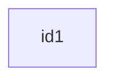

- A node with text
```
graph LR
    id1[This is the text in the box]
```
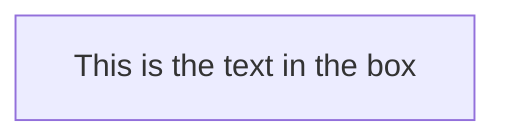

- A node with round edges
```
graph LR
    id1(This is the text in the box);
```
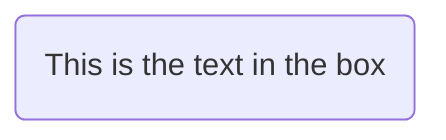
- A node in the form of a circle
```
    graph LR
        id1((This is the text in the circle));
```
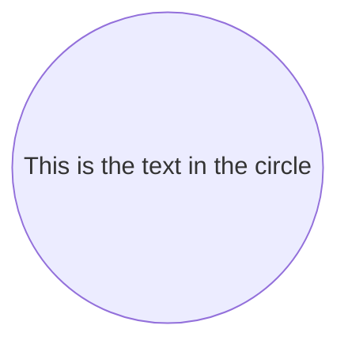
- A node in an asymetric shape
```
graph LR
    id1>This is the text in the box]
```
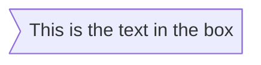
- A node (rhombus)
```
graph LR
    id1{This is the text in the box}
```
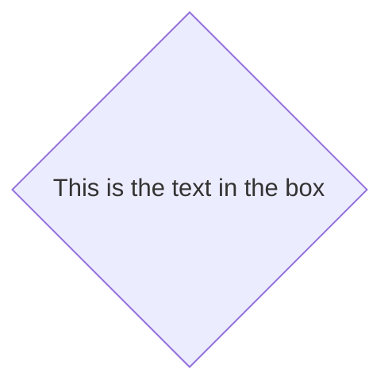

#### Links between nodes

- A link with arrow head
```
graph LR
    A-->B
```


- An open link
```
graph LR
    A --- B
```
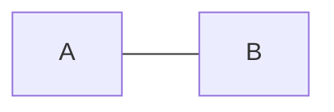
- Text on links
```
graph LR
A-- This is the text --- B
```
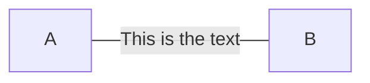

or
```
graph LR
A---|This is the text|B;
```


- A link with arrow head and text
```
graph LR
A-->|text|B
```
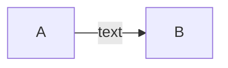

or
```
graph LR
A-- text -->B
```


- Dotted link
```
graph LR
A-.->B
```
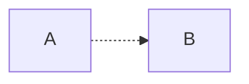

- Dotted link with text
```
graph LR
A-. text .->B
```
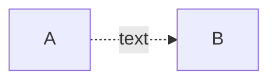

- Thick link
```
graph LR
A==>B
```
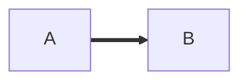

- Thick link with text
```
graph LR
A== text ==>B
```
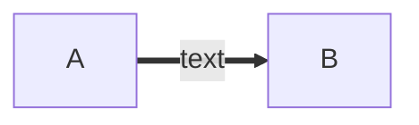

### Subgraphs
```
%% Subgraph example
graph TB
        subgraph one
        a1-->a2
        end
        subgraph two
        b1-->b2
        end
        subgraph three
        c1-->c2
        end
        c1-->a2
```
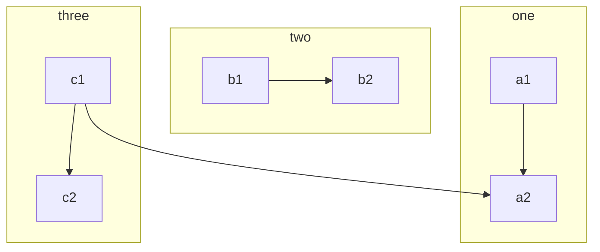

### Styling a node
```
%% Example code
graph LR
    id1(Start)-->id2(Stop)
    style id1 fill:#f9f,stroke:#333,stroke-width:4px;
    style id2 fill:#ccf,stroke:#f66,stroke-width:2px,stroke-dasharray: 5, 5;
```
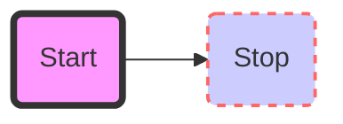

## 案例：
```
%% Code for flowchart below
graph TB
    sq[Square shape] --> ci((Circle shape))

    subgraph A subgraph
        od>Odd shape]-- Two line<br>edge comment --> ro
        di{Diamond with <br/> line break} -.-> ro(Rounded<br>square<br>shape)
        di==>ro2(Rounded square shape)
    end

    %% Notice that no text in shape are added here instead that is appended further down
    e --> od3>Really long text with linebreak<br>in an Odd shape]

    %% Comments after double percent signs
    e((Inner / circle<br>and some odd <br>special characters)) --> f(,.?!+-*ز)

    cyr[Cyrillic]-->cyr2((Circle shape Начало));

     classDef green fill:#9f6,stroke:#333,stroke-width:2px;
     classDef orange fill:#f96,stroke:#333,stroke-width:4px;
     class sq,e green
     class di orange
```
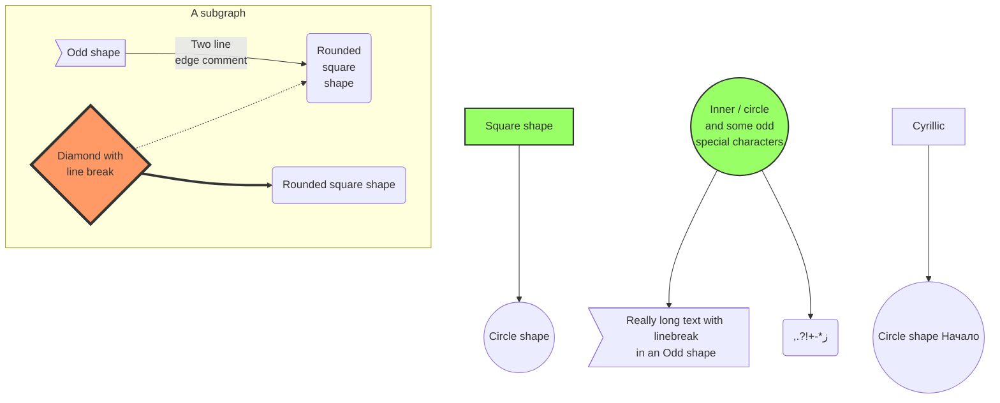


```
graph BT
A[Christmas] --> B(go shopping)
B --> C{let me think}
C-->|one| D[laptop]
C--> |two| E[iphone]
C--> |three| F{a}
```
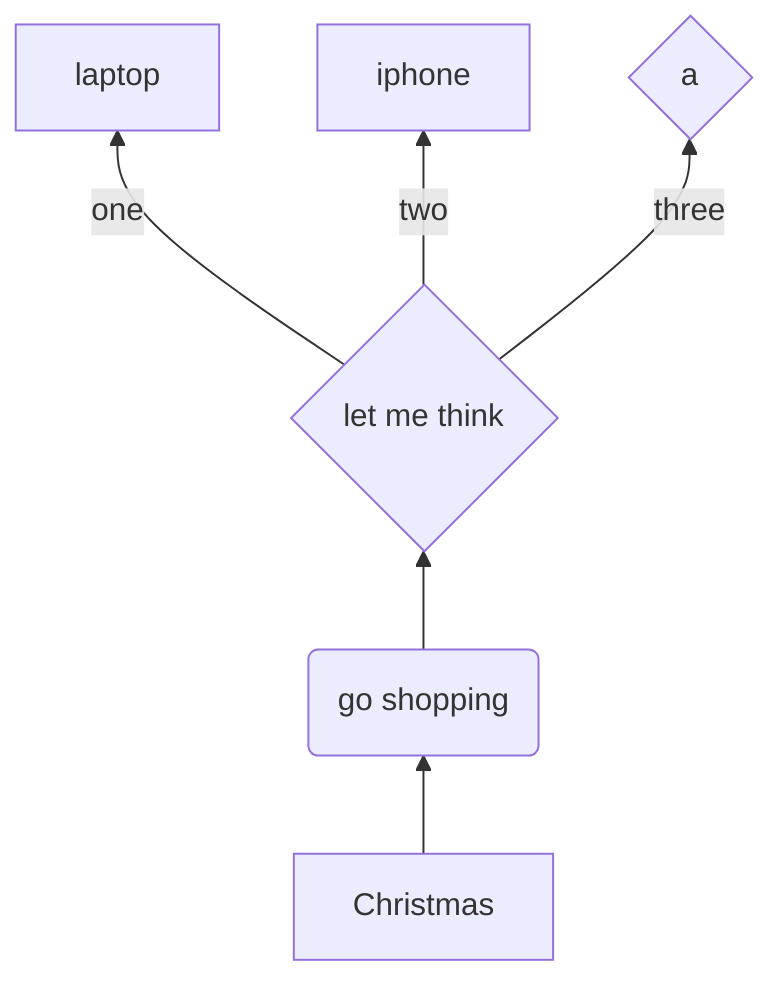
