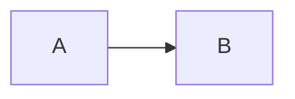

# 主要配置

## 主题
目前提供三套主题可供选择，模仿 [Vue](//vuejs.org) 和 [buble](//buble.surge.sh) 官网订制的主题样式。还有 [@liril-net](https://github.com/liril-net) 贡献的黑色风格的主题。

```html
  <link rel="stylesheet" href="//unpkg.com/docsify/themes/vue.css">
  <link rel="stylesheet" href="//unpkg.com/docsify/themes/buble.css">
  <link rel="stylesheet" href="//unpkg.com/docsify/themes/dark.css">
  <link rel="stylesheet" href="//unpkg.com/docsify/themes/pure.css">
```


- [更多 docsify-themeable](https://jhildenbiddle.github.io/docsify-themeable/#/) A delightfully simple theme system for docsify.


## 封面

通过设置 `coverpage` 参数，可以开启渲染封面的功能。具体用法见[配置项#coverpage](configuration.md#coverpage)。


封面的生成同样是从 markdown 文件渲染来的。开启渲染封面功能后在文档根目录创建 `_coverpage.md` 文件。渲染效果如本文档。

```index.html
<script>
  window.$docsify = {
    coverpage: true
  }
</script>
<script src="//unpkg.com/docsify"></script>
```

```_coverpage.md_


# docsify

> A magical documentation site generator.

* Simple and lightweight (~12kb gzipped)
* Multiple themes
* Not build static html files

[GitHub](https://github.com/docsifyjs/docsify/)
[Get Started](#quick-start)
```


## 全文搜索 - Search

全文搜索插件会根据当前页面上的超链接获取文档内容，在 `localStorage` 内建立文档索引。默认过期时间为一天，当然我们可以自己指定需要缓存的文件列表或者配置过期时间。

```html
<script>
  window.$docsify = {
    search: 'auto', // 默认值

    search : [
      '/',            // => /README.md
      '/guide',       // => /guide.md
      '/get-started', // => /get-started.md
      '/zh-cn/',      // => /zh-cn/README.md
    ],

    // 完整配置参数
    search: {
      maxAge: 86400000, // 过期时间，单位毫秒，默认一天
      paths: [], // or 'auto'
      placeholder: 'Type to search',

      // 支持本地化
      placeholder: {
        '/zh-cn/': '搜索',
        '/': 'Type to search'
      },

      noData: 'No Results!',

      // 支持本地化
      noData: {
        '/zh-cn/': '找不到结果',
        '/': 'No Results'
      },

      // 搜索标题的最大程级, 1 - 6
      depth: 2
    }
  }
</script>
<script src="//unpkg.com/docsify"></script>
<script src="//unpkg.com/docsify/lib/plugins/search.js"></script>
```

[更多插件](https://docsify.js.org/#/zh-cn/plugins)


## 支持 mermaid

```js
// Import mermaid
//  <link rel="stylesheet" href="//cdn.jsdelivr.net/npm/mermaid/dist/mermaid.min.css">
//  <script src="//cdn.jsdelivr.net/npm/mermaid/dist/mermaid.min.js"></script>

mermaid.initialize({ startOnLoad: false });

window.$docsify = {
  markdown: {
    renderer: {
      code: function(code, lang) {
        if (lang === "mermaid") {
          return (
            '<div class="mermaid">' + mermaid.render(lang, code) + "</div>"
          );
        }
        return this.origin.code.apply(this, arguments);
      }
    }
  }
}
```



# 代码高亮

内置的代码高亮工具是 [Prism](https://github.com/PrismJS/prism)，默认支持 CSS、JavaScript 和 HTML。如果需要高亮其语言——例如 PHP——可以手动引入代码高亮插件。

```html
<script src="//unpkg.com/docsify"></script>
<script src="//unpkg.com/prismjs/components/prism-bash.js"></script>
<script src="//unpkg.com/prismjs/components/prism-php.js"></script>
```

?> 其他的语言高亮插件可以查看[Prims 仓库](https://github.com/PrismJS/prism/tree/gh-pages/components)。


## 演示
```py
import tensorflow as tf
```

>我是引用

定义
:    我是定义

!> 叹号引用

?> 问好引用
